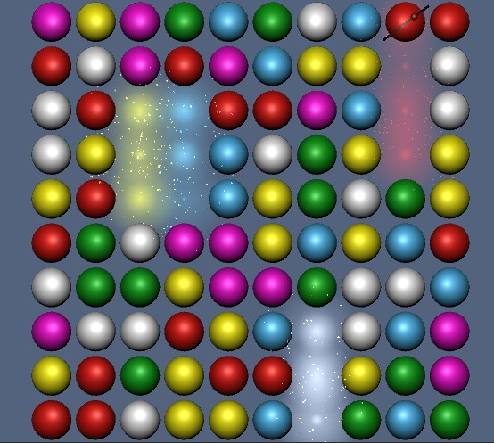

# Match-3

Swap two balls near to each other to form line of 3 or more identical colored balls.

Such line will disappear and filed by balls from above.

If your line had 4 and more balls one "graviton" will appear in random spot in a line. Destroying that ball changes the direction of balls falling.

Made using Unity DOTS (https://unity.com/dots).

* [Windows build](https://drive.google.com/file/d/1Bht-qK5q9AuvTNQoSxVwUW444vPEZVRY)
